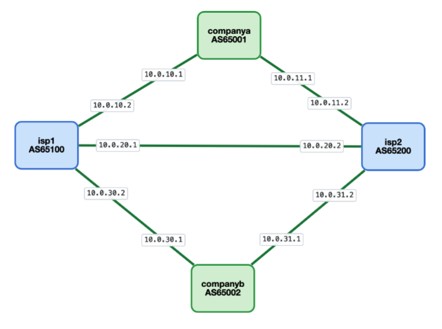

# Simple BGP Lab

A 4-node FRR lab — two companies multi-homed to two ISPs — focused on the bread-and-butter BGP knobs: **AS-path prepend, LOCAL_PREF, MED, and failover**.
Feel free to modify, add more routers, more connections.

## Topology



### Addressing

| Link                  | Network        | `.1`     | `.2`     |
|-----------------------|----------------|----------|----------|
| companyA ↔ ISP1       | 10.0.10.0/30   | companyA | ISP1     |
| companyA ↔ ISP2       | 10.0.11.0/30   | companyA | ISP2     |
| ISP1 ↔ ISP2           | 10.0.20.0/30   | ISP1     | ISP2     |
| companyB ↔ ISP1       | 10.0.30.0/30   | companyB | ISP1     |
| companyB ↔ ISP2       | 10.0.31.0/30   | companyB | ISP2     |

### Announced prefixes & pingable hosts

| AS      | Prefix           | Pingable host (on `lo`) | Origin   |
|---------|------------------|-------------------------|----------|
| 65001   | 10.1.1.0/24      | **10.1.1.1**            | companyA |
| 65002   | 192.168.1.0/24   | **192.168.1.1**         | companyB |

The two ISPs (AS65100, AS65200) don't originate any prefixes — they only transit routes between the two companies.

`10.1.1.1/32` and `192.168.1.1/32` are bound to the loopback of each company router so they actually respond to ICMP. Use them as targets for `ping` / `traceroute` end-to-end. Each router-id loopback (`10.255.0.1`, `10.255.0.2`) stays where it is.

## Lifecycle

```bash
cd simple/

sudo clab deploy -t simple.clab.yml
sudo clab inspect -t simple.clab.yml
sudo clab destroy -t simple.clab.yml
```

Container names: `clab-simple-lab-companya`, `clab-simple-lab-isp1`, `clab-simple-lab-isp2`, `clab-simple-lab-companyb`, `clab-simple-lab-dashboard`.

> **Live dashboard**: this YAML also brings up the BGP dashboard at `http://<host>:8088`. The image must be built once before the first deploy:
> ```bash
> cd ../dashboard && sudo docker build -t bgp-dashboard:latest .
> ```
> Full details and how to point the dashboard at other labs are in [`../dashboard/README.md`](../dashboard/README.md).

## Exercises

Each exercise is independent. Always run **Exercise 0** first to confirm the lab converged.

---

### 0. Baseline — verify both companies see each other

```bash
docker exec clab-simple-lab-companya vtysh -c "show ip bgp summary"
docker exec clab-simple-lab-companya vtysh -c "show ip bgp"
docker exec clab-simple-lab-companyb vtysh -c "show ip bgp"
```

Expected:
- companyA has 2 eBGP sessions (ISP1, ISP2), both **Established**.
- companyA's BGP table shows **two paths** to `192.168.1.0/24`: one via each ISP. AS-paths are `65100 65002` and `65200 65002`.
- companyB symmetrically sees two paths to `10.1.1.0/24`.
- One path is marked best (`>`); the tiebreaker line says `Older Path` since everything else is equal.

End-to-end reachability test (uses the loopback hosts):

```bash
docker exec clab-simple-lab-companya ping -I 10.1.1.1 -c2 192.168.1.1
docker exec clab-simple-lab-companya traceroute -n -s 10.1.1.1 192.168.1.1
docker exec clab-simple-lab-companyb ping -I 192.168.1.1 -c2 10.1.1.1
docker exec clab-simple-lab-companyb traceroute -n -s 192.168.1.1 10.1.1.1
```

Both pings should succeed; traceroute should show 2 hops (one ISP, then the destination).

> **Why `-I` / `-s`?** Without an explicit source, `ping` and `traceroute` use the **outgoing interface** IP (e.g., `10.0.10.1` on companyA) as source. That address belongs to the `10.0.10.0/30` p2p link, which isn't announced via BGP — so the reply has nowhere to go and gets dropped. Sourcing from the loopback fixes it because `10.1.1.0/24` *is* announced. This is also how real network operators routinely run health checks: always source from a known-routable loopback.

---

### 1. AS-path prepend — push inbound traffic to the other ISP

Goal: companyA wants traffic from companyB to arrive via **ISP2**, not ISP1. The lever is to make companyA's announcement to ISP1 look longer (more AS-path hops), so when ISP1 propagates it onward, the path looks worse.

On **companyA**:

```
vtysh
configure terminal
route-map TO-ISP1-OUT permit 10
 set as-path prepend 65001 65001 65001
exit
router bgp 65001
 address-family ipv4 unicast
  neighbor 10.0.10.2 route-map TO-ISP1-OUT out
end
clear bgp 10.0.10.2 out
```

Verify on **companyB**:

```bash
docker exec clab-simple-lab-companyb vtysh -c "show ip bgp 10.1.1.0/24"
```

Expected: best path to `10.1.1.0/24` is now via **ISP2** (`10.0.31.2`). The ISP1 path is still in the table, but its AS-path is `65100 65001 65001 65001 65001` — longer than `65200 65001` — so companyB picks ISP2.

This is **inbound TE**: you control where return traffic *enters your network* by manipulating what the other side sees.

To revert:
```
configure terminal
router bgp 65001
 address-family ipv4 unicast
  no neighbor 10.0.10.2 route-map TO-ISP1-OUT out
end
clear bgp 10.0.10.2 out
```

---

### 2. LOCAL_PREF — control your own outbound traffic

Goal: companyA wants outbound traffic toward `192.168.1.0/24` to leave via **ISP1**. LOCAL_PREF is the cleanest knob for this — it's local to your AS and beats almost every other tiebreaker.

On **companyA**:

```
vtysh
configure terminal
route-map FROM-ISP1-IN permit 10
 set local-preference 200
exit
router bgp 65001
 address-family ipv4 unicast
  neighbor 10.0.10.2 route-map FROM-ISP1-IN in
end
clear bgp 10.0.10.2 in
```

Verify:
```bash
docker exec clab-simple-lab-companya vtysh -c "show ip bgp 192.168.1.0/24"
docker exec clab-simple-lab-companya ip route show 192.168.1.0/24
```

Expected:
- The path via ISP1 now shows `localpref 200`; the ISP2 path still shows default 100.
- Best-path line: `best (Local Pref)`.
- Kernel FIB sends `192.168.1.0/24` via `10.0.10.2` (ISP1).

LOCAL_PREF vs prepend, in one line: **prepend influences others; LOCAL_PREF influences yourself.**

To revert:
```
configure terminal
router bgp 65001
 address-family ipv4 unicast
  no neighbor 10.0.10.2 route-map FROM-ISP1-IN in
end
clear bgp 10.0.10.2 in
```

---

### 3. MED — hint to a single neighbor which entry to prefer

Goal: companyB tells **ISP1** "if you have the choice, prefer the link to me with MED=100". MED only influences a *single neighbor AS* between two parallel links — it's the soft signal you send to your direct upstream.

For MED to actually have something to compare on, ISP1 needs to learn `192.168.1.0/24` two ways. The current topology has only one link companyB↔ISP1, so we'll make MED visible in a different angle: companyB sends different MEDs on its two announcements (one to each ISP), and we observe how ISP1 vs. ISP2 use them.

On **companyB**:

```
vtysh
configure terminal
route-map TO-ISP1-OUT permit 10
 set metric 100
exit
route-map TO-ISP2-OUT permit 10
 set metric 200
exit
router bgp 65002
 address-family ipv4 unicast
  neighbor 10.0.30.2 route-map TO-ISP1-OUT out
  neighbor 10.0.31.2 route-map TO-ISP2-OUT out
end
clear bgp * out
```

Verify on **ISP1** and **ISP2**:

```bash
docker exec clab-simple-lab-isp1 vtysh -c "show ip bgp 192.168.1.0/24"
docker exec clab-simple-lab-isp2 vtysh -c "show ip bgp 192.168.1.0/24"
```

Each ISP sees the route both directly from companyB AND via the other ISP. With MED differences:
- ISP1 sees its direct path with MED=100, and the indirect path (via ISP2) with MED=200 — chooses direct (lower MED wins).
- ISP2 sees its direct path with MED=200, and the indirect path (via ISP1) with MED=100. **But MED is only compared between paths from the same neighbor AS** by default. ISP2's two paths come from different ASes (companyB direct vs ISP1), so MED doesn't help — best path still picked by AS-path length (direct wins, length 1 vs 2).

Lesson: **MED is weak.** It only tiebreaks among paths from the same neighbor AS. For real inbound TE, prepend is more reliable.

To revert:
```
configure terminal
router bgp 65002
 address-family ipv4 unicast
  no neighbor 10.0.30.2 route-map TO-ISP1-OUT out
  no neighbor 10.0.31.2 route-map TO-ISP2-OUT out
end
clear bgp * out
```

---

### 4. Failover — kill a link and watch BGP converge

Goal: pre-set companyA to prefer ISP1 (Exercise 2 above), then kill the ISP1 link and confirm traffic flips to ISP2 within a few seconds.

Start by re-applying Exercise 2 if you reverted it (LOCAL_PREF 200 on FROM-ISP1-IN). Then:

```bash
# kill the link
docker exec clab-simple-lab-isp1 ip link set eth1 down

# watch the table on companyA
docker exec clab-simple-lab-companya vtysh -c "show ip bgp 192.168.1.0/24"
```

Expected: BGP HOLD timer expires (default 180s, but you'll often see it faster because the kernel surfaces interface-down events sooner). After convergence:
- ISP1 path is gone from companyA's table.
- Best path is via ISP2.
- Kernel FIB updated.

Bring it back:
```bash
docker exec clab-simple-lab-isp1 ip link set eth1 up
```

For faster convergence in real-world setups, BGP needs **BFD** (Bidirectional Forwarding Detection) — a ~50ms heartbeat that triggers session teardown long before the BGP hold timer would fire. FRR supports BFD; an extension exercise is to enable it on the companyA↔ISP1 session and re-time the failover.

---

### 5. Combine prepend + LOCAL_PREF for full traffic engineering

Goal: companyA wants:
- **Outbound** traffic to companyB → exit via ISP1 (LOCAL_PREF on FROM-ISP1-IN, Exercise 2)
- **Inbound** traffic from companyB → arrive via ISP1 (so flows are symmetric)

For the inbound side, you'd prepend on the announcement to ISP2 (so ISP1 looks better to companyB). Combine the two route-maps:

On **companyA**:

```
vtysh
configure terminal
route-map FROM-ISP1-IN permit 10
 set local-preference 200
exit
route-map TO-ISP2-OUT permit 10
 set as-path prepend 65001 65001 65001
exit
router bgp 65001
 address-family ipv4 unicast
  neighbor 10.0.10.2 route-map FROM-ISP1-IN in
  neighbor 10.0.11.2 route-map TO-ISP2-OUT out
end
clear bgp * in
clear bgp * out
```

Verify symmetric flow:
```bash
docker exec clab-simple-lab-companya vtysh -c "show ip bgp 192.168.1.0/24"
docker exec clab-simple-lab-companyb vtysh -c "show ip bgp 10.1.1.0/24"
```

Both sides should now best-path through ISP1.

This pattern — LOCAL_PREF on inbound from preferred-upstream + prepend on outbound to less-preferred-upstream — is the standard multi-homing playbook every dual-homed customer eventually learns.

---

## Quick reference

| Knob | Where to apply | Affects | Strength |
|---|---|---|---|
| **LOCAL_PREF** | inbound route-map (your side) | your outbound choice | very high (step 2) |
| **AS-path prepend** | outbound route-map | other side's inbound choice | medium (step 4) |
| **MED** | outbound route-map | adjacent AS's tiebreak | low (step 6, often ignored) |
| **Communities** | both | meta-language for any of the above | as strong as the action they trigger |

## Troubleshooting

| Symptom | Check |
|---|---|
| Sessions not Established | `docker logs clab-simple-lab-isp1`, verify peer IPs |
| Best-path didn't change | `clear bgp * in` (or `out` for outbound policies) |
| Route-map seems ignored | `show route-map <NAME>` — `Invoked: 0` means it isn't matching |
| Need traffic capture | `apk add --no-cache tcpdump` then `tcpdump -nni eth1 port 179` |
