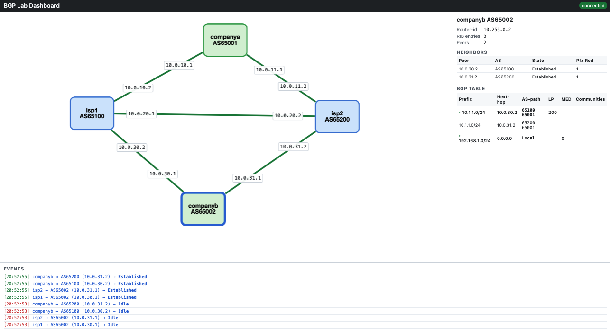

# BGP Lab Dashboard

A live web dashboard for the simple-lab. Polls every FRR router every 2 seconds via `docker exec ... vtysh -c "show ip bgp ... json"` and pushes diffs to your browser over a WebSocket.

## What you see

- **Topology graph** — one node per router, one edge per BGP session. Edge color = session state (green Established, amber transitioning, red down).
- **Sidebar** — click any node to see its BGP summary, neighbors, and full BGP table including communities.
- **Event log** — streaming list of session up/down and best-path changes.




## How it deploys with the lab

The dashboard is wired into `simple.clab.yml` as a regular clab node:

```yaml
nodes:
  companya: {...}
  isp1:     {...}
  isp2:     {...}
  companyb: {...}
  dashboard:
    kind: linux
    image: bgp-dashboard:latest
    ports:
      - 8088:8080                                    # host:container
    env:
      LAB_TOPOLOGY: /lab/topology.yml
      LAB_PREFIX: clab-simple-lab
    binds:
      - /var/run/docker.sock:/var/run/docker.sock    # to docker exec into peers
      - simple.clab.yml:/lab/topology.yml:ro         # so poller knows the nodes
      - configs:/lab/configs:ro                      # to extract AS numbers from frr.conf
```

So `sudo clab deploy -t simple.clab.yml` brings up all 5 containers (4 routers + dashboard) in one shot. `sudo clab destroy -t simple.clab.yml` tears all 5 down.

The only thing clab does **not** do is build the dashboard image — clab assumes images already exist. So the first-time workflow is:

```bash
# 1. Build the image. Only needed once, or whenever you change dashboard code.
cd dashboard/
sudo docker build -t bgp-dashboard:latest .

# 2. Deploy lab + dashboard together.
cd ..
sudo clab deploy -t simple.clab.yml

# 3. Open the UI
#    http://<host>:8088
```

The image is ~150 MB (Python slim + FastAPI + docker SDK). After the first build, redeploys are fast since the image is cached.

## Restarting just the dashboard (without disturbing the lab)

clab is all-or-nothing — it has no per-node redeploy. If you change dashboard code and want to see it live without tearing down BGP state, bypass clab and use `docker run` directly:

```bash
sudo docker rm -f clab-simple-lab-dashboard
sudo docker run -d --name clab-simple-lab-dashboard \
  --network clab \
  -p 8088:8080 \
  -e LAB_PREFIX=clab-simple-lab \
  -v /var/run/docker.sock:/var/run/docker.sock \
  -v simple.clab.yml:/lab/topology.yml:ro \
  -v /configs:/lab/configs:ro \
  bgp-dashboard:latest
```

(Adjust the host paths to wherever your config lives.) The next `clab destroy + deploy` will then pick up the dashboard normally again.

## Running against a different lab

The dashboard isn't hard-coded to the simple-lab. To point it at the original 6-node lab (or any other), set `LAB_PREFIX` to that lab's container prefix and bind its topology YAML:

```bash
sudo docker run -d --name bgp-dashboard \
  --network clab \
  -p 8088:8080 \
  -e LAB_PREFIX=clab-bgp-lab \
  -v /var/run/docker.sock:/var/run/docker.sock \
  -v /home/pc/bgp/bgp-lab.clab.yml:/lab/topology.yml:ro \
  -v /home/pc/bgp/configs:/lab/configs:ro \
  bgp-dashboard:latest
```

Topology nodes are discovered from the YAML at startup, so a dashboard restart is needed if you add/remove nodes from the underlying lab.

## How it works

```
Browser ◄── WebSocket ── FastAPI ◄── docker.sock ──► FRR containers
                          │
                          └── 2 s polling loop ───┐
                                                  ▼
                          show ip bgp summary json
                          show ip bgp json
```

The polling loop runs as an asyncio task. It diffs each new state against the previous one; if anything changed it broadcasts a state snapshot plus per-event messages (session-state-change and best-path-change). The browser keeps a copy of the latest state and re-renders the sidebar on click and on any update.

## Files

| Path | Role |
|---|---|
| `Dockerfile` | python:3.12-slim base + FastAPI + docker SDK |
| `requirements.txt` | pinned deps |
| `app/main.py` | FastAPI app: `/`, `/api/state`, `/ws` |
| `app/poller.py` | async polling, state diff, event generation |
| `app/static/index.html` | shell layout |
| `app/static/dashboard.js` | Cytoscape graph + WebSocket client |
| `app/static/styles.css` | basic styling |

## Extending

- **Different lab**: set `LAB_PREFIX` env var (e.g., `LAB_PREFIX=clab-bgp-lab` for the original 6-node lab) and bind that lab's topology YAML to `/lab/topology.yml`.
- **More polling fields**: add to `poller._poll_node_sync()` (e.g., `show ip route json`).
- **Highlight best-path edges**: in `dashboard.js`, walk the BGP table for the selected node and add a CSS class to edges that match.
- **Auto-refresh layout less aggressively**: the current `cose` layout reruns on every state diff which can jiggle nodes; switch to `preset` after the first build to keep positions stable.

## Known limits (MVP)

- Edge labels (CIDRs from clab YAML) aren't shown — only color-coded state. Easy to add.
- "Best path" highlighting is in the table only, not on the graph yet.
- No authentication. Run on a trusted network.
- Container detection requires the docker socket; if SELinux/AppArmor on your host blocks it, mount with `:Z` or relax policy.
